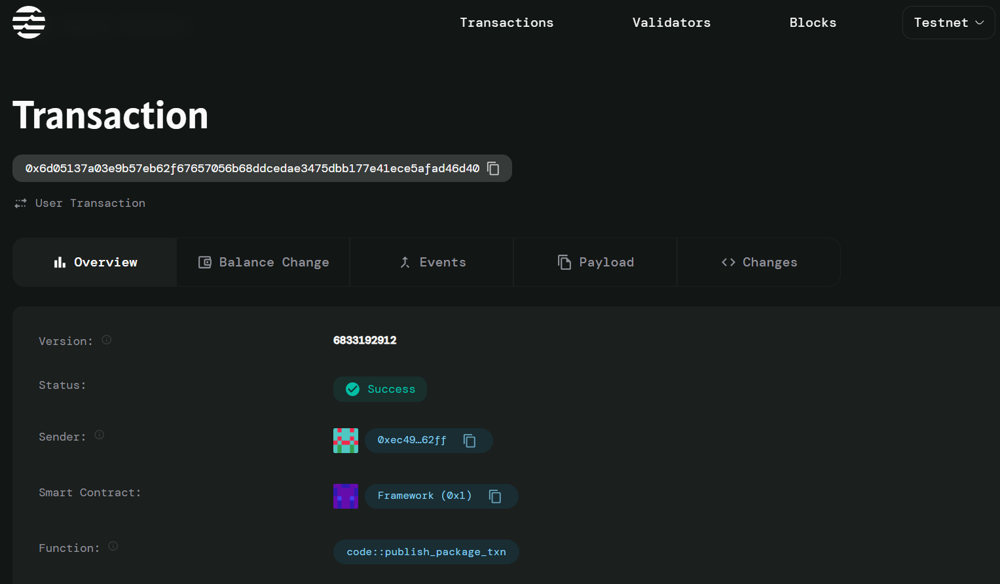

# Token with Blacklist

## Project Description

This smart contract implements a comprehensive token management system with blacklist functionality and approval mechanisms for delegated transfers. The contract enables secure token operations while maintaining strict access control through blacklisting capabilities. It provides essential features for managing token allowances, ensuring that only authorized and non-blacklisted addresses can participate in token transfers and approvals.

## Project Vision

Our vision is to create a secure and compliant token management system that empowers organizations and individuals to maintain strict control over token transfers while enabling flexible delegation mechanisms. By combining blacklist functionality with approval systems, we aim to provide a robust foundation for regulatory compliance and enhanced security in decentralized finance applications.

The contract serves as a building block for applications requiring:
- Regulatory compliance through address restrictions
- Secure delegation of transfer rights
- Transparent and auditable token operations
- Protection against malicious actors through blacklisting

## Key Features

### 🔒 **Blacklist Management**
- Comprehensive blacklist system to restrict unauthorized addresses
- Real-time validation of addresses before approving allowances
- Enhanced security through proactive address filtering

### 📝 **Approval & Allowance System**
- Secure approval mechanism for delegated transfers
- Dynamic allowance management with update capabilities
- Owner-controlled permission system for token spending

### 🛡️ **Security Features**
- Owner-based access control for critical operations
- Address validation before any token operations
- Automatic prevention of blacklisted address interactions

### ⚡ **Efficient Operations**
- Optimized data structures for quick lookups
- Gas-efficient allowance management
- Streamlined approval and blacklist processes

### 🎯 **Compliance Ready**
- Built-in mechanisms for regulatory compliance
- Audit-friendly transparent operations
- Flexible framework adaptable to various compliance requirements

## Future Scope

### 🔮 **Enhanced Features**
- **Multi-signature Approvals**: Implement multi-sig requirements for high-value allowances
- **Time-locked Allowances**: Add expiration dates to approved allowances for enhanced security
- **Role-based Access Control**: Expand beyond owner-only control to include multiple administrative roles
- **Batch Operations**: Enable bulk blacklist updates and allowance approvals for efficiency

### 🌐 **Integration Capabilities**
- **Cross-chain Compatibility**: Extend functionality to support cross-chain token operations
- **DeFi Protocol Integration**: Seamless integration with lending, staking, and yield farming protocols
- **Governance Token Support**: Add voting and governance capabilities to the token system
- **Oracle Integration**: Connect with price oracles for dynamic allowance limits

### 📊 **Analytics & Monitoring**
- **Transaction Analytics**: Comprehensive tracking and reporting of all token operations
- **Compliance Reporting**: Automated generation of compliance reports for regulatory bodies
- **Real-time Monitoring**: Alert systems for suspicious activities and blacklist violations
- **Performance Metrics**: Track system performance and optimization opportunities

### 🔧 **Technical Enhancements**
- **Gas Optimization**: Further optimize smart contract operations for lower transaction costs
- **Upgradeable Contracts**: Implement proxy patterns for future contract upgrades
- **Advanced Security**: Integration with formal verification tools and security audits
- **Interoperability**: Support for multiple token standards and blockchain networks

## Contract Details
0xf645a3eb60e0a0f9c1e65dea9f615d11a2d698740834fe485d9dba918d4c15de
